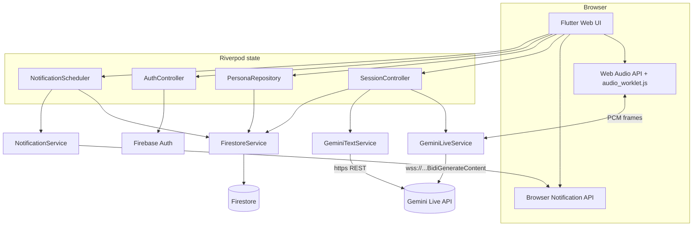
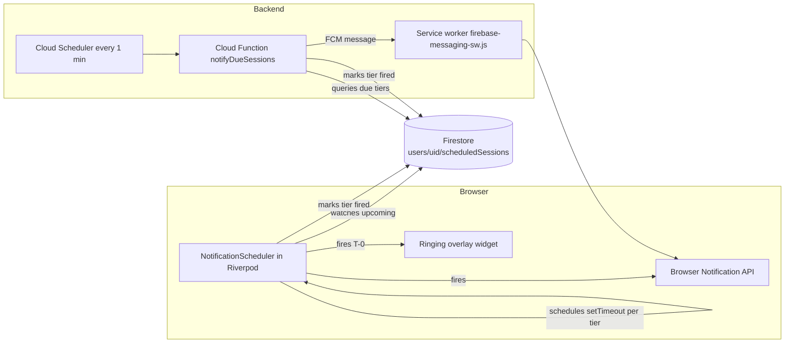

# Networking Simulator Hackathon MVP

## Constraints driving this plan

- ~24 hours, single demo target.
- Flutter Web only. All other platform folders ignored.
- Gemini Live (`gemini-2.5-flash-preview-native-audio-dialog`) over WebSocket. Direct browser-to-Google connection. API key embedded via `flutter_dotenv`.
- 3 templated personas + a working custom-persona editor (used live on stage as a 4th).
- Firebase Google sign-in + Firestore for sessions, transcripts, summaries, custom personas.
- Cross-session memory via Gemini-text-generated summary injected into the next session's system instruction.
- Scheduling cut down to a static next-session card + a single Firestore row + an LLM recommendation on the feedback screen. No real notifications, no calendar page.

## Architecture




The hot loop in a live call: mic chunks from `audio_worklet.js` → `GeminiLiveService` base64-encodes and sends `realtimeInput` frames over WS → Gemini emits audio + text deltas → `GeminiLiveService` queues PCM chunks back into the worklet for playback and pushes transcript turns into `SessionController`.

## File layout

```
networking_simulator/
  pubspec.yaml                                # add deps below
  .env                                        # GEMINI_API_KEY, gitignored
  prompts/
    recruiter.md
    hiring_manager.md
    networking_event.md
    feedback_judge.md
    summary_writer.md
  web/
    audio_worklet.js                          # mic resampler + PCM playback queue
    index.html                                # <script src="audio_worklet.js">, dark bg
  lib/
    main.dart                                 # Firebase.initializeApp + ProviderScope + dotenv
    app.dart                                  # MaterialApp.router, dark theme, GoRouter
    models/
      persona.dart
      session.dart
      transcript_turn.dart
      feedback_report.dart
    services/
      gemini_live_service.dart                # WS client, audio I/O glue
      gemini_text_service.dart                # judge + summary REST calls
      firestore_service.dart                  # CRUD for sessions, personas, summaries
      audio_io.dart                           # dart:js_interop wrapper for audio_worklet.js
      notification_service.dart               # Browser Notification API wrapper (+ FCM in stretch)
    state/
      auth_controller.dart                    # Riverpod Notifier wrapping FirebaseAuth
      persona_repository.dart                 # templates + user personas merge
      session_controller.dart                 # owns the live call lifecycle
      notification_scheduler.dart             # tier timers driven by Firestore upcoming-sessions stream
      router.dart                             # GoRouter config + auth redirect
    agents/
      persona_agent.dart                      # builds Live API system_instruction
      feedback_agent.dart                     # judges transcript -> FeedbackReport
      summary_agent.dart                      # writes the next-session summary
    screens/
      auth_screen.dart                        # "Sign in with Google" only
      home_screen.dart                        # hero, scenario cards, next-session card
      scenario_select_screen.dart             # 3 templates + "Create custom" tile
      persona_editor_screen.dart              # name, role, prompt textarea, save
      call_screen.dart                        # phone-call UI
      feedback_screen.dart                    # score, metrics, narrative, next-session
    widgets/
      caller_avatar.dart
      transcript_panel.dart
      soundwave.dart                          # canned animation, not amplitude-driven
      call_controls.dart                      # mute, hang up, push-to-talk
      scenario_card.dart
      next_session_card.dart
      ringing_overlay.dart                    # full-bleed Answer/Decline overlay at T-0
```

For the stretch FCM path only (do not create unless attempting step 10):

```
networking_simulator/
  web/
    firebase-messaging-sw.js                  # service worker for background pushes
  functions/
    package.json
    src/
      notifyDueSessions.ts                    # Cloud Scheduler -> Firestore poll -> FCM
```

## Backend / Frontend split

This is a Flutter Web app, not a FastAPI server. The "backend" you'll build is Dart code that runs in the same browser bundle as the UI, so there is no HTTP boundary, no `/api/*` routes, no JSON-over-HTTP between layers. The contract that does the same job as your FastAPI OpenAPI doc is a small set of **Dart abstract classes + Riverpod providers + model classes**.

### Mental model translation

- A `BaseModel` Pydantic class becomes a `class Persona { ... }` in [lib/models/](networking_simulator/networking_simulator/lib/models/).
- An `@app.post("/sessions/{id}")` route handler becomes a method on a service class in [lib/services/](networking_simulator/networking_simulator/lib/services/).
- `Depends(get_db)` dependency injection becomes a `Provider` declaration in [lib/state/](networking_simulator/networking_simulator/lib/state/).
- The frontend's `await fetch('/api/...')` becomes `ref.watch(someProvider)` in a Flutter widget.
- Your OpenAPI / Swagger spec becomes the abstract class signatures plus the model classes — this is what `docs/FRONTEND_CONTRACT.md` will hold.
- A FastAPI mock server becomes a `MockXService` Dart class behind the same abstract interface, swapped in via Riverpod override.

### Folder ownership

Backend dev (you) — anything that talks to the network or holds state:

- `lib/models/`, `lib/services/`, `lib/agents/`, `lib/state/`
- `prompts/`, `web/audio_worklet.js`
- `.env`, `lib/firebase_options.dart`, `pubspec.yaml`

Frontend dev — anything the user looks at:

- `lib/screens/`, `lib/widgets/`
- `lib/app.dart` (you ship the skeleton with the router and dark theme; they own the visual treatment)
- `web/index.html` (favicons, meta tags)

### The contract

For each screen, this is the entire surface area the frontend dev consumes. Everything else is opaque — they never touch a `WebSocketChannel` or a `FirebaseFirestore` instance.

- `**auth_screen.dart`**
  - reads `authStateProvider` -> `AsyncValue<User?>`
  - calls `authControllerProvider.notifier.signInWithGoogle()`, `.signOut()`
- `**home_screen.dart**`
  - reads `userProfileProvider` -> `UserProfile`
  - reads `recentSessionsProvider` -> `AsyncValue<List<Session>>`
  - reads `nextSessionProvider` -> `AsyncValue<ScheduledSession?>`
- `**scenario_select_screen.dart**`
  - reads `personasProvider` -> `AsyncValue<List<Persona>>` (templates + user-authored, merged)
  - navigates to `/persona-editor` or `/call/:personaId`
- `**persona_editor_screen.dart**`
  - calls `personaRepositoryProvider.notifier.savePersona(Persona p)` -> `Future<String>`
- `**call_screen.dart**` — the centerpiece
  - reads `sessionControllerProvider(personaId)` -> `SessionState`
  - calls on the notifier: `Future<void> hangUp()`, `void toggleMute()`, `void pushToTalk(bool isDown)`
  - `SessionState` is the only type the call screen needs to know:

```dart
    class SessionState {
      final Persona persona;
      final List<TranscriptTurn> transcript;
      final Duration elapsed;
      final bool isMuted;
      final bool isAiSpeaking;
      final SessionPhase phase;   // .connecting | .live | .ended | .error
      final String? error;
    }
    

```

- `**feedback_screen.dart**`
  - reads `feedbackProvider(sessionId)` -> `AsyncValue<FeedbackReport>` (streamed)
  - calls `feedbackControllerProvider.notifier.scheduleNext(ScheduledSession s)`

### Service interface pattern

Every service used by the controllers is defined as an abstract class first. The real implementation and the mock both implement it. The Riverpod provider picks one based on a build-time flag.

```dart
// lib/services/gemini_live_service.dart
abstract class GeminiLiveService {
  Stream<TranscriptTurn> get transcripts;
  Stream<bool> get isAiSpeaking;
  Future<void> connect({required String systemInstruction, required String voice});
  Future<void> disconnect();
  void setMuted(bool muted);
}

class RealGeminiLiveService implements GeminiLiveService { /* WS + audio worklet */ }
class MockGeminiLiveService implements GeminiLiveService { /* canned 5-turn convo */ }

final geminiLiveServiceProvider = Provider<GeminiLiveService>((ref) {
  const useMocks = bool.fromEnvironment('USE_MOCKS');
  return useMocks ? MockGeminiLiveService() : RealGeminiLiveService(/* deps */);
});
```

The frontend dev runs `flutter run -d chrome --dart-define=USE_MOCKS=true`. They never need the Gemini key or Firebase setup to build screens.

Mocks to ship by hour ~3 of the build:

- `MockGeminiLiveService`: emits a hardcoded 5-turn transcript with realistic delays, flips `isAiSpeaking` every ~2s.
- `MockFirestoreService`: in-memory `Map`s that satisfy the same interface as the real one.
- `MockFeedbackAgent`: returns a static `FeedbackReport` after a 1.5s delay so the frontend can build loading states.

### Hand-off document

Write `docs/FRONTEND_CONTRACT.md` once at the start of hour 2 and keep it updated as the contract evolves. It should contain:

1. The "per-screen contract" list above, in tabular form.
2. Copy-pasted definitions of every model class (`Persona`, `Session`, `TranscriptTurn`, `FeedbackReport`, `SessionState`, `SessionPhase`, `UserProfile`, `ScheduledSession`).
3. The `flutter run --dart-define=USE_MOCKS=true` instructions plus a "what each mock does" table so the frontend dev knows what to expect on screen.
4. A short note that anything not listed here is private — they should not import from `lib/services/`, `lib/agents/`, or anything in `lib/state/` other than the listed providers.

This file is your OpenAPI spec. If you change a method signature without updating it, the frontend dev's branch breaks.

## Scheduled notifications (the anticipation arc)

A single "your session is starting" ping is forgettable. A tiered schedule sells the anticipation: pre-call build-up, last-second nerves, then a phone literally ringing on the home screen.

### Tiered schedule

For real schedules:

- T-24h: gentle reminder ("Your Recruiter Practice is tomorrow at 6:30 PM")
- T-1h: pre-call prep ("Your call with Sarah is in 1 hour. Tonight's focus: ask three follow-up questions.")
- T-5min: "Almost time. Take a breath."
- T-0: full-screen **ringing overlay** on the home page (pulsing avatar, persona name, green Answer / red Decline)

For demo dry-runs we compress to T-60s / T-15s / T-0 so the audience can experience the full arc in a minute.

### Two-tier architecture

Both paths run side-by-side and dedupe on a per-tier `firedAt` flag in Firestore.



**MVP path (in-tab, required for demo, ~1.5 hours)**

- New `lib/services/notification_service.dart` (abstract + `BrowserNotificationService` real impl + `MockNotificationService`).
- `lib/state/notification_scheduler.dart` is a Riverpod `Notifier` that watches `users/{uid}/scheduledSessions` and, for each upcoming session, sets a `Timer` per tier (`twoMin`, `thirtySec`, `atTime`). Skips tiers already in `firedAt`. Cancels and re-arms on Firestore changes.
- On boot the scheduler also requests `Notification` permission via `Notification.requestPermission()` (gated behind a Riverpod-driven dialog so we don't ambush the user).
- T-2min and T-30s tiers fire a `Notification(title, body)` if the tab is unfocused, and a SnackBar/banner if the tab is focused.
- T-0 tier sets `homeScreenStateProvider` to `Ringing(personaId)`. The home screen renders a full-bleed ringing overlay (pulsing `caller_avatar`, name, two big circular buttons; Answer routes to `/call/:personaId`, Decline writes a `dismissed` flag and clears the overlay). Optional 8-bar ringtone via `dart:js_interop` to a small WebAudio oscillator.

**Stretch path (real push, optional, ~3 hours)**

Only attempt after the demo path is solid.

- Add `firebase_messaging: ^15.1.3` to pubspec.
- Create `web/firebase-messaging-sw.js` (small Firebase-provided template plus a custom `push` event handler that displays the notification).
- On auth, call `FirebaseMessaging.instance.getToken(vapidKey: ...)` and write the token to `users/{uid}/fcmTokens/{tokenId}`.
- Cloud Function `functions/src/notifyDueSessions.ts` triggered by Cloud Scheduler every 1 minute (1 free job covers it). Queries `collectionGroup('scheduledSessions').where('nextFireAt', '<=', now)`, sends an FCM message per token, atomically updates `firedAt`. Uses Firestore transactions to avoid double-fire when both the in-tab scheduler and the Cloud Function race.
- Requires upgrading the Firebase project to **Blaze plan** — still inside the free tier for hackathon traffic, but the user must have a billing account attached. If billing setup is a blocker, drop the stretch and keep the MVP path.

### Data model addition

Extend the existing `Session`/`ScheduledSession` models:

```dart
enum NotificationTier { twoMin, thirtySec, atTime }

class ScheduledSession {
  final String id;
  final String personaId;
  final DateTime scheduledAt;
  final Map<NotificationTier, DateTime?> firedAt;   // null = not yet fired
  final bool dismissed;
}
```

`firedAt` lets both the in-tab scheduler and the Cloud Function dedupe via a transactional compare-and-set on the tier's entry.

### Demo-time helper

Add a hidden dev affordance on the scheduling button: long-press to schedule the session **60 seconds out** instead of using the picker. Lets the demoer trigger the full anticipation arc on stage in under a minute without faking timestamps in the database.

## Dependencies to add to [networking_simulator/pubspec.yaml](networking_simulator/networking_simulator/pubspec.yaml)

- `flutter_riverpod: ^2.5.1`
- `flutter_dotenv: ^5.1.0`
- `web_socket_channel: ^2.4.5`
- `firebase_core: ^3.6.0`, `firebase_auth: ^5.3.1`, `cloud_firestore: ^5.4.4`, `google_sign_in: ^6.2.1`
- `firebase_messaging: ^15.1.3` (only needed for the stretch push path; MVP uses raw `Notification` API via `dart:js_interop`)
- `go_router: ^14.2.7`
- `web: ^1.0.0` (for `dart:js_interop` browser bindings)
- `uuid: ^4.5.0`

Skip codegen (`freezed`, `json_serializable`) to save time. Hand-write `fromJson`/`toJson`.

## Implementation order (24h budget)

The order is chosen so each block produces something demoable, the riskiest pieces are spiked first, and the frontend dev is unblocked as early as possible.

1. **Skeleton + theme** (~45 min)
  - Wipe `lib/main.dart` counter app, install deps, set up `flutter_dotenv`, dark `ThemeData`, `ProviderScope`, `GoRouter` with three routes (`/`, `/scenarios`, `/call/:sessionId`, `/feedback/:sessionId`).
2. **Contract + mocks** (~1.5 hours, unblocks the other dev)
  - Write the abstract interfaces in `lib/services/` and the model classes in `lib/models/`.
  - Author `docs/FRONTEND_CONTRACT.md` — the per-screen provider/method/model list above, with copy-pasted class definitions.
  - Implement the three mocks (`MockGeminiLiveService` with a canned 5-turn transcript, `MockFirestoreService` in-memory, `MockFeedbackAgent` static report).
  - Wire the `bool.fromEnvironment('USE_MOCKS')` switch in each provider so `flutter run -d chrome --dart-define=USE_MOCKS=true` boots the whole app on mocks.
  - Hand the branch to the frontend dev. From here both devs work in parallel.
3. **Gemini Live spike** (~3 hours, highest risk)
  - Write `web/audio_worklet.js`: a single `AudioWorkletProcessor` that downsamples mic to 16 kHz mono PCM and posts `Int16Array` chunks; a small playback class that queues `AudioBuffer`s on a `gainNode`.
  - Implement `services/audio_io.dart` via `dart:js_interop` — exposes `Stream<Uint8List> micFrames()`, `void enqueuePlayback(Uint8List pcm24k)`, `void stop()`.
  - Implement `services/gemini_live_service.dart` (`RealGeminiLiveService`): opens the Live WS, sends initial `setup` with `system_instruction` + voice config, pumps `realtimeInput.audio` from mic frames, decodes server messages, emits `Stream<TranscriptTurn>` and pipes audio chunks to `audio_io`.
  - Standalone test page at `/spike` that proves audio round-trip with a hardcoded prompt before touching the rest of the UI.
4. **Auth + Firestore wiring** (~1 hour)
  - Firebase project, enable Google sign-in, register web app, copy config into `lib/firebase_options.dart` (via `flutterfire configure`).
  - `auth_controller.dart` exposes `Stream<User?>`. `router.dart` redirects unauth'd users to `/auth`.
  - `firestore_service.dart` with three collections: `users/{uid}/sessions`, `users/{uid}/personas`, `users/{uid}/summaries/{personaId}`.
5. **Persona system** (~1.5 hours)
  - Three markdown files in [prompts/](networking_simulator/networking_simulator/prompts/) authored by hand: Recruiter, Hiring Manager, Networking Event Attendee. Each is a system-instruction template with `{{industry}}`, `{{difficulty}}`, `{{style}}` placeholders + a goal list block.
  - `persona_repository.dart`: loads templates from assets at startup, fetches user personas from Firestore, merges into a single `List<Persona>`.
  - `persona_editor_screen.dart`: form with name, role, voice pick, free-form prompt textarea, Save button → writes to Firestore, navigates to `/call`.
6. **Call screen** (~2 hours)
  - Phone-call layout: full-bleed dark gradient, big circular avatar, persona name, timer, transcript panel scrolls under avatar, three round buttons at bottom (mute, end, push-to-talk).
  - `session_controller.dart` is a `Notifier<SessionState>` that owns: persona, system instruction (template filled + summary prepended), `GeminiLiveService` instance, transcript list, timer ticker, mute flag.
  - On end: stop service, write transcript + duration to Firestore, navigate to `/feedback/:sessionId`.
7. **Scenario select + Home** (~1 hour)
  - `scenario_select_screen.dart`: grid of `ScenarioCard`s built from `personaRepository`, last tile is "+ Create Custom".
  - `home_screen.dart`: hero text, "Start Practice" CTA, last 3 scenarios, `NextSessionCard` reading from `users/{uid}/nextSession`.
8. **Feedback screen** (~1.5 hours)
  - `feedback_agent.dart`: single Gemini text call with the rubric prompt from [prompts/feedback_judge.md](networking_simulator/networking_simulator/prompts/feedback_judge.md), constrained to JSON output (`{score, fillerCount, strongestMoment, areasForImprovement, recommendedNext}`).
  - `summary_agent.dart`: a parallel Gemini text call that produces a 2-3 sentence summary of the conversation; written to `users/{uid}/summaries/{personaId}` for the next session.
   - `feedback_screen.dart`: streams the judge call, renders score gauge, metric chips, two narrative cards, "Schedule Practice" button writes a Firestore row used by the home page's next-session card.
9. **Scheduled notifications — MVP path** (~1.5 hours)
   - `lib/services/notification_service.dart`: abstract interface + `BrowserNotificationService` (calls `Notification.requestPermission()` and `new Notification(...)` via `dart:js_interop`) + `MockNotificationService` (just logs).
   - `lib/state/notification_scheduler.dart`: Riverpod `Notifier` that watches the user's `scheduledSessions` Firestore stream and arms one `Timer` per tier per session (`twoMin`, `thirtySec`, `atTime`), skipping tiers already in `firedAt`, transactionally writing `firedAt` when each tier fires.
   - `lib/widgets/ringing_overlay.dart`: full-bleed pulsing-avatar overlay shown over the home page when `homeScreenStateProvider` enters `Ringing(personaId)`. Green Answer routes to `/call/:personaId`, red Decline writes `dismissed: true`. Optional 8-bar ringtone via a small WebAudio oscillator.
   - Long-press on the "Schedule Practice" button schedules 60 seconds out for demo-flow testing.
10. **Scheduled notifications — push stretch** (~3 hours, optional, only if MVP and demo flow are solid)
    - Add `firebase_messaging` and create `web/firebase-messaging-sw.js`.
    - Save FCM tokens to `users/{uid}/fcmTokens/{tokenId}` on auth.
    - Cloud Function `functions/src/notifyDueSessions.ts` triggered by Cloud Scheduler every 1 minute. Queries due tiers via collection group, sends FCM, transactionally updates `firedAt`. Requires Firebase Blaze plan; abandon if billing setup blocks.
11. **Polish + demo dry-run** (~1 hour)
    - Loading/error states for WS drops. Disable controls until WS `setup_complete`. Microphone permission rationale dialog. Test the on-stage custom-persona flow twice end-to-end. Run a full anticipation-arc dry-run with a 60-second-out scheduled session and verify all three notification tiers fire on time.

## Hard cuts from PRODUCT.md (revisit if time allows)

- Calendar page with edit/delete (scheduling lives only on the home page next-session card + the feedback screen's "Schedule Practice" button).
- The full AI scheduling chatbot — replaced by a single recommendation field in the feedback JSON.
- Light mode toggle. Hardcoded dark.
- Profile page, registration form. We pull profession/industry/etc. from the Google account name + a single dropdown shown the first time the user opens scenario select.
- Audio recording storage. Transcripts only.
- Real soundwave amplitude. Canned looping animation.
- Multiple TTS voices per persona. One voice per persona, hardcoded in the template.

## Open risks

- **Gemini Live availability and quotas** for `gemini-2.5-flash-preview-native-audio-dialog`. Falls back to `gemini-2.0-flash-live-001` (cheaper, half-cascaded, fine for demo) if the premium model gates us.
- **Audio worklet interop**. The single biggest unknown. The spike in step 2 is the gating de-risk. If it isn't working by hour 4, we fall back to STT + Gemini text + browser `SpeechSynthesis` per follow-up question A.
- **Firebase setup time**. `flutterfire configure` + Google sign-in OAuth client setup can eat 45 minutes of fiddly Console clicks. If it's not done in 1 hour we drop auth and stuff everything in browser `localStorage` for the demo.

